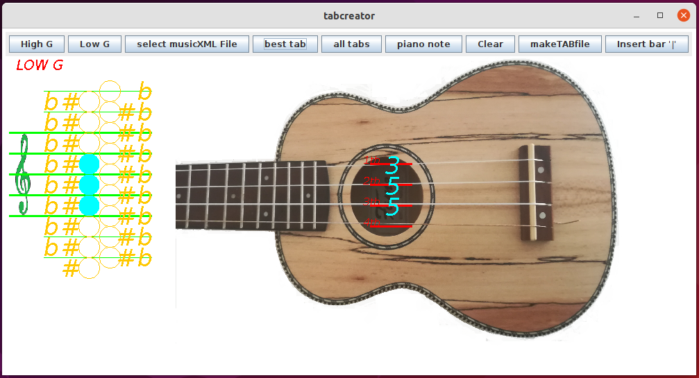
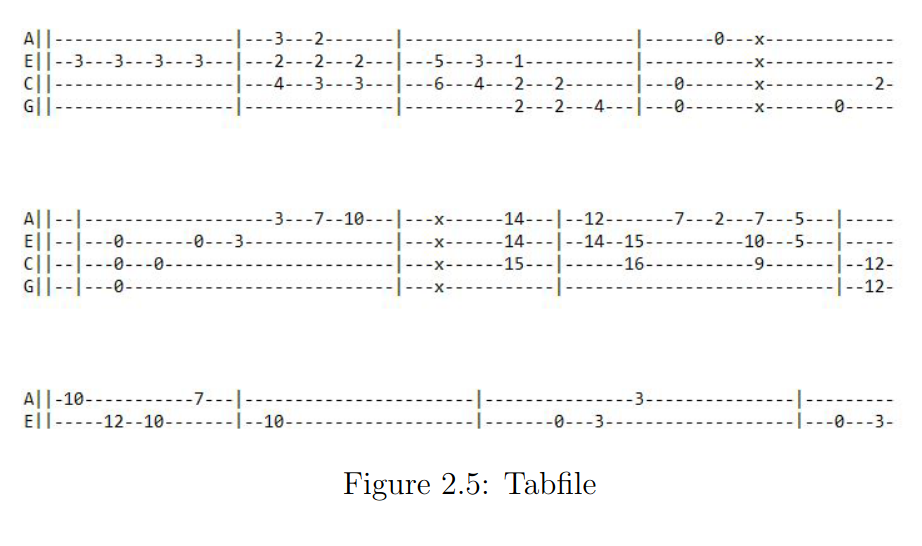

# Tabcreator
Converts piano sheet music to ukulele tabs and writes them to a file. The program can also convert a triad or a four tone. 
The best possible tab will be calculated. 
Best means, the tab with the shortest distances, so that all notes are close together on the fretboard, 
so one can play it without problems.

## GUI



## About
What Tabcreator does:
* <span style="color:grey"> Create Ukulele Tab sheets
* <span style="color:grey"> Transcribe piano sheet music (musicxml files) to ukulele tab sheet
* <span style="color:grey"> Shows piano notes of a ukulele tab  

## Create ukuele tab sheets
To find the TAB for a chord (fig. 2.1) click on the notes (fig. 2.2) and then click the ```best tab``` button.
The corresponding tab will then be shown (fig. 2.3). A whole tab sheet can be created like that. Enter chord by chord and
click the ```best tab``` button after every chord.


A barline (fig. 2.4) can be inserted by clicking the ```insert bar``` button. 


To save all the generated tabs to a file click the ```make tabfile``` button, and a tabfile will be generated (fig. 2.5)



## Transcribe piano cheet music to ukuele sheet music
Click the ```select musicxml file``` button. Then select a ```.musicxml```
or ```.mxl``` file. Then a tabfile will be generated. A ```.musicxml``` or ```.mxl``` file can be
created by Programs like Musescore or Audiveris from a pdf file or a Pic.
  
## Show piano notes
Double  click somewhere on the GUI, then a popmenu will show where you can enter a ukulele tab. Then click ```piano note```
and the corresponding piano note will be displayed.  

## Release 
Find the release and download for Linux/Unix and Windows here:  
